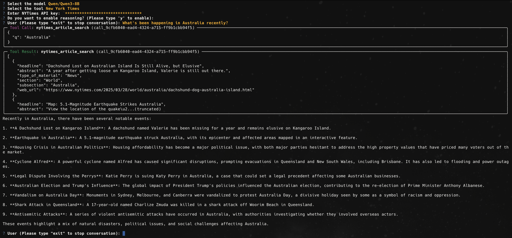

# Tool Sampler (Python)

This is an example project that demonstrates how to use various tools with Ailoy across different models.



**Usage:**

```sh
pip install -r requirements.txt
python -m tool_sampler
```

You can try out the following tools:
- Frankfurter: Real-time foreign exchange rate API
- TMDB (requires API key): Movie-related information
- New York Times (requires API key): Articles and news content

To use TMDB, you need to obtain an API key from the [following link](https://developer.themoviedb.org/docs/getting-started).
For the New York Times API, you also need to get an API key from their [developer portal](https://developer.nytimes.com/get-started).

Additionally, if you're using an OpenAI model, you must provide an OpenAI API key as well.
